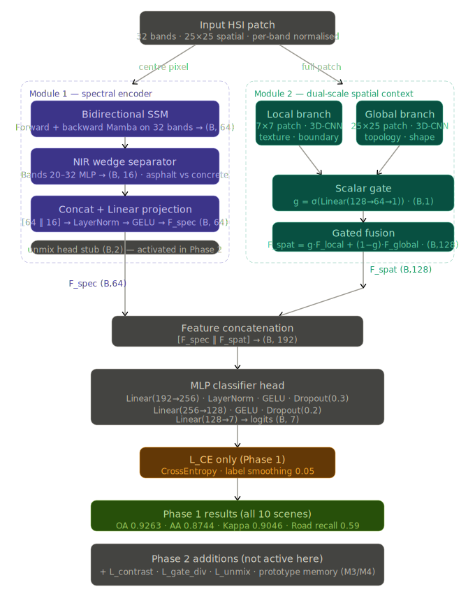
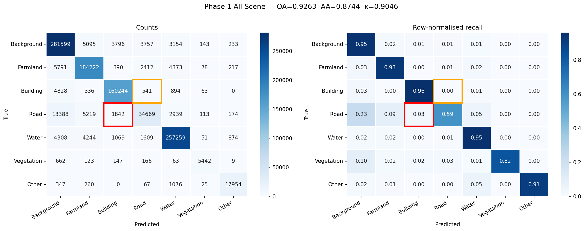
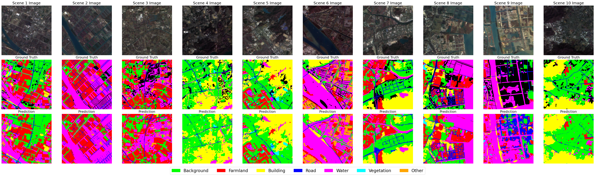

# Hy-BiSSM — Hybrid Bidirectional State Space Model for Hyperspectral Image Classification

> **Hyperspectral Land-Cover Classification on the OHID-1 Dataset**  
> Dual-branch architecture combining Bidirectional Mamba (SSM) spectral encoding with 3D-CNN dual-scale spatial context.

---

## Results at a Glance

| Metric | Score |
|--------|-------|
| Overall Accuracy (OA) | **92.63 %** |
| Average Accuracy (AA) | **87.44 %** |
| Cohen's Kappa (κ) | **0.9046** |

Trained across all **10 scenes** of the OHID-1 dataset (~2.26 M labeled pixels, 32-band hyperspectral imagery, 512 × 512 px per scene).

---

## Architecture Overview



### High-Level Design

```
Input Hyperspectral Pixel (32 bands)
          │
          ├─────────────────────────┬─────────────────────────────┐
          │                         │                             │
   ┌──────▼───────┐      ┌──────────▼──────────┐                 │
   │  Bi-SSM      │      │  NIR Wedge          │                 │
   │  (Mamba fwd  │      │  Separator          │                 │
   │   + Mamba bwd│      │  (bands 19–31)      │                 │
   │   → 64-dim)  │      │  (→ 16-dim)         │                 │
   └──────┬───────┘      └──────────┬──────────┘                 │
          │                         │                             │
          └──────────┬──────────────┘                             │
                     │                                            │
              ┌──────▼───────┐                                    │
              │  SpectralEncoder                                  │
              │  Linear proj → 64-dim                            │
              └──────┬───────┘                                    │
                     │ spec_feat (64)                             │
                     │                              ┌─────────────▼──────────────┐
                     │                              │  DualScaleSpatialContext    │
                     │                              │                            │
                     │                              │  Local Branch (7×7 patch)  │
                     │                              │   3D-CNN → 128-dim         │
                     │                              │                            │
                     │                              │  Global Branch (25×25 patch│
                     │                              │   3D-CNN → 128-dim         │
                     │                              │                            │
                     │                              │  Scalar gate g ∈ [0,1]     │
                     │                              │  spat = g·F_l+(1-g)·F_g   │
                     │                              └─────────────┬──────────────┘
                     │                                            │ spat_feat (128)
                     └────────────────────┬───────────────────────┘
                                          │  cat → 192-dim
                                     ┌────▼────┐
                                     │ MLP Head│
                                     │ 256→128 │
                                     │  →  7   │
                                     └────┬────┘
                                          │
                                    Class Logits
```

---

## Module Breakdown

### Module 1 — Spectral Encoder (`SpectralEncoder`)

| Sub-module | Description | Output dim |
|---|---|---|
| `BidirectionalSSM` | Forward + backward Mamba scan over 32 spectral bands. Falls back to BiGRU if `mamba_ssm` is unavailable. | 64 (32×2, mean-pooled) |
| `NIRWedgeSeparator` | Dedicated 2-layer MLP on near-infrared bands (indices 19–31) to capture vegetation / water separability. | 16 |
| Projection | Linear + LayerNorm + GELU fusing SSM and NIR features. | 64 (`SPEC_DIM`) |
| `unmix_head` | Auxiliary 2-endmember abundance head (Softmax). Used for spectral unmixing regularisation when `LAMBDA_UNMIX > 0`. | 2 |

### Module 2 — Dual-Scale Spatial Context (`DualScaleSpatialContext`)

| Sub-module | Patch | Description | Output dim |
|---|---|---|---|
| `SpatialBranch` (local) | 7 × 7 | 3-layer 3D-CNN capturing fine-grained edges and textures | 128 |
| `SpatialBranch` (global) | 25 × 25 | Same architecture at coarser spatial scale to capture surroundings | 128 |
| Scalar gate | — | Linear bottleneck → Sigmoid; learns per-sample trade-off between local detail vs. global context | scalar g |
| Fused | — | `g·F_local + (1-g)·F_global` | 128 (`SPAT_DIM`) |

The 3D-CNN in each branch uses progressively smaller spectral kernels `(7,3,3) → (5,3,3) → (3,3,3)` with BatchNorm + GELU activations.

### Full Network — `HyBiSSMNet`

```
HyBiSSMNet(
  spectral_encoder: SpectralEncoder          → 64-dim
  spatial_context:  DualScaleSpatialContext  → 128-dim
  classifier:       Linear(192→256) + LN + GELU + Dropout(0.3)
                    Linear(256→128) + GELU + Dropout(0.2)
                    Linear(128→7)
  prototype_memory: buffer (7, 10, 64)       [for future scene-memory use]
)
Total parameters: ~177,034
```

---

## Dataset — OHID-1

| Property | Value |
|---|---|
| Scenes | 10 (December 2019, urban + peri-urban) |
| Image size | 512 × 512 pixels |
| Spectral bands | 32 (visible + near-infrared) |
| Classes | 7 (Background, Farmland, Building, Road, Water, Vegetation, Other) |
| Labeled pixels (total) | ~2.26 M |

### Data Split (per scene, stratified)

| Split | Ratio |
|---|---|
| Train | 10 % of labeled pixels |
| Val | 45 % |
| Test | 45 % |

---

## Training Configuration

```python
BATCH_SIZE   = 256          # fill A100 80 GB; reduce to 128 if OOM
EPOCHS       = 150
LR           = 3e-4         # AdamW
WEIGHT_DECAY = 1e-4
PATIENCE     = 20           # early stopping on val OA
SCHEDULER    = CosineAnnealingLR(T_max=150, eta_min=1e-6)
LABEL_SMOOTH = 0.05         # in CrossEntropyLoss
GRAD_CLIP    = 1.0          # max norm
```

Data augmentation: random horizontal and vertical flips applied to **both** local and global patches simultaneously.

---

## Loss Function — `HyBiSSMLoss`

$$\mathcal{L} = L_{CE} + \lambda_{c} \cdot L_{contrast} + \lambda_{u} \cdot L_{unmix} + \lambda_{m} \cdot L_{morph}$$

| Term | Active | Description |
|---|---|---|
| $L_{CE}$ | Always | Cross-entropy with label smoothing 0.05 |
| $L_{contrast}$ | `LAMBDA_CONTRAST > 0` | Pairwise contrastive loss pushing Road and Building prototypes apart (margin = 1.0) |
| $L_{unmix}$ | `LAMBDA_UNMIX > 0` | MSE on endmember abundance predictions |
| $L_{morph}$ | `LAMBDA_MORPH > 0` | External geometry prior (passed in as argument) |

Default run: **only** $L_{CE}$ is active (`λ_c = λ_u = λ_m = 0.0`).

---

## Outputs

| File | Description |
|---|---|
| `hybissm_net_all10.pt` | Best model checkpoint (state dict + optimizer + metrics) |
| `all10_prototypes.pt` | Per-scene, per-class mean spectral feature vectors |
| `learning_curves.png` | Training/val loss, OA, AA, and κ over epochs |
| `confusion_matrix.png` | Count and row-normalised recall heatmaps |

---

## Qualitative Results

### Confusion Matrix (All 10 Scenes, Test Split)



Red box: Road→Building confusion (23 % of Roads mis-classified as Building).  
Orange box: Building→Road confusion (< 1 %).

### Scene-wise Predictions (Input · Ground Truth · Prediction)



---

## Reproduction

### Prerequisites

```bash
pip install torch torchvision
pip install mamba-ssm --no-build-isolation   # requires CUDA 11.8+
pip install numpy scipy scikit-learn matplotlib seaborn rasterio
```

### Directory Layout

```
project/
├── OHID-1/
│   ├── images/   # 201912_1.mat … 201912_10.mat  (or .tif)
│   └── labels/   # 201912_1.mat … 201912_10.mat  (or .tif)
└── train_hybissm.py
```

### Run

```bash
# Fresh training
python train_hybissm.py            # set RESUME_FROM_CHECKPOINT = False in script

# Resume from checkpoint
python train_hybissm.py            # RESUME_FROM_CHECKPOINT = True  (default)
```

### Multi-GPU

DataParallel is applied automatically when `torch.cuda.device_count() > 1`. The batch size of 256 is tuned for one A100-80 GB; scale proportionally for other hardware.

---

## File Index

| File | Role |
|---|---|
| `train_hybissm.py` | Complete training, evaluation, and prototype extraction pipeline |
| `hybissm_net_all10.pt` | Best checkpoint (not tracked by git — add to `.gitignore`) |
| `all10_prototypes.pt` | Scene prototype bank |
| `hybissm_confusion_matrix.png` | Test-set confusion matrix |
| `hybissm_predictions.png` | Scene-wise visual predictions |
| `architecture.svg` | Model architecture diagram |
| `learning_curves.png` | Generated after training |
| `confusion_matrix.png` | Generated after training |

---

## Citation

If you use this work, please cite the OHID-1 dataset paper and acknowledge the Hy-BiSSM architecture.

---

*Hy-BiSSM — Minor Project, IIIT Bangalore, 6th Semester, 2026*
